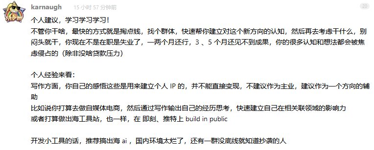

# 随笔

1、
你是在害怕，
无人问津的孤独？
或是，
狂欢之后的孤独？

2、
只有满是污秽，淫秽的文字，
才能安抚你心中慌张？
才能冲刷你对生活的不满？
才能让你做到安心恬荡是吗？

3、怎样天真无邪地穿上也怎样脱下

4、人都会有摔屁股蹲儿的时候

5、再好看的女人，住在这厂子里，都迟早没了个形状

6、能跟一个人心意相通，分享激情。此生足矣

7、
又一次从她的学校回去。
街边的小店已与白天不同。
路灯下的景色让人垂涎、不能忘却、不能触碰、不能留存

何时才能遇见她
何时才能碰见那天的景色、温度

8、无法承受太多过于真实的真实

9、只要你还有个好故事，和一个够倾诉的人，你就永远不会完蛋。 ——海上钢琴师

10、你的每一步就像账单，每一笔花销都微不足道，但月底汇总时却总是出其的吓人

11、学习 是一种不让人生走错路的智慧

12、我理解你，我相信你，我选择你，我爱你！

13、所遇皆欢喜，所得皆善良，目明心亮，立心力行

14、趣人

15、不要灰心，不要沮丧，趁你处于还能犯错的年纪，学会克服挫折的办法也很重要

16、

17、
