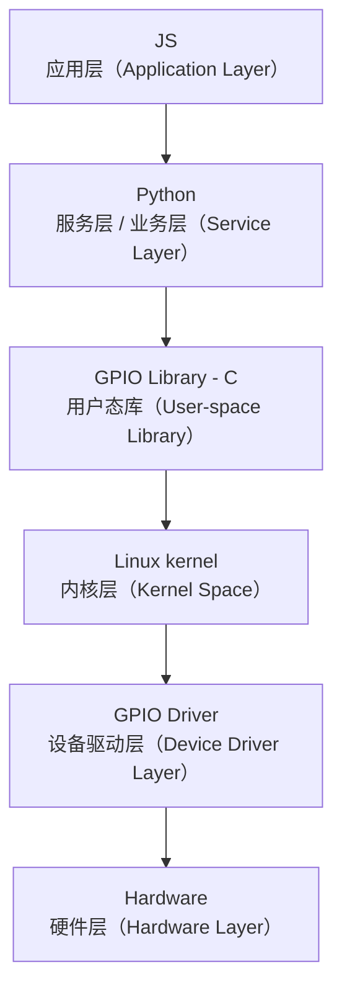

# Application to Hardware Call Chain

```mermaid
flowchart TB

    A[JS<br/>应用层（Application Layer）]
    B[Python<br/>服务层 / 业务层（Service Layer）]
    C[GPIO Library - C<br/>用户态库（User-space Library）]
    D[Linux kernel<br/>内核层（Kernel Space）]
    E[GPIO Driver<br/>设备驱动层（Device Driver Layer）]
    F[Hardware<br/>硬件层（Hardware Layer）]

    A --> B --> C --> D --> E --> F
```
