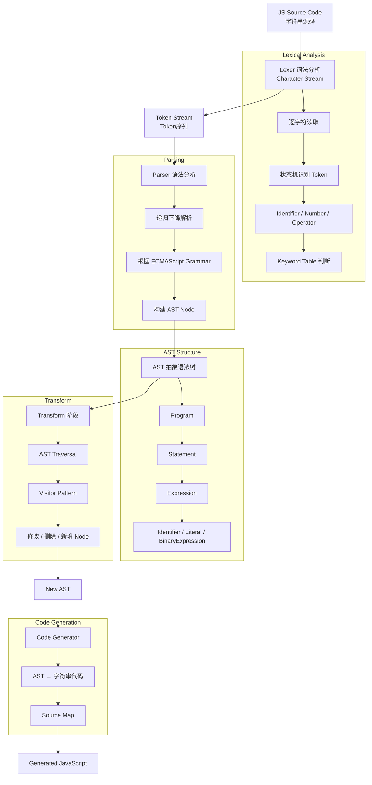

# AST

```mermaid
flowchart TB

    A[JS Source Code<br/>字符串源码] --> B[Lexer 词法分析<br/>Character Stream]
    B --> C[Token Stream<br/>Token序列]

    subgraph Lexical Analysis
    B --> B1[逐字符读取]
    B1 --> B2[状态机识别 Token]
    B2 --> B3[Identifier / Number / Operator]
    B3 --> B4[Keyword Table 判断]
    end

    C --> D[Parser 语法分析]

    subgraph Parsing
    D --> D1[递归下降解析]
    D1 --> D2[根据 ECMAScript Grammar]
    D2 --> D3[构建 AST Node]
    end

    D3 --> E[AST 抽象语法树]

    subgraph AST Structure
    E --> E1[Program]
    E1 --> E2[Statement]
    E2 --> E3[Expression]
    E3 --> E4[Identifier / Literal / BinaryExpression]
    end

    E --> F[Transform 阶段]

    subgraph Transform
    F --> F1[AST Traversal]
    F1 --> F2[Visitor Pattern]
    F2 --> F3[修改 / 删除 / 新增 Node]
    end

    F3 --> G[New AST]

    G --> H[Code Generator]

    subgraph Code Generation
    H --> H1[AST → 字符串代码]
    H1 --> H2[Source Map]
    end

    H2 --> I[Generated JavaScript]
```

<!-- https://chatgpt.com/c/698d8e99-2050-8325-9d21-8d411add9782 -->