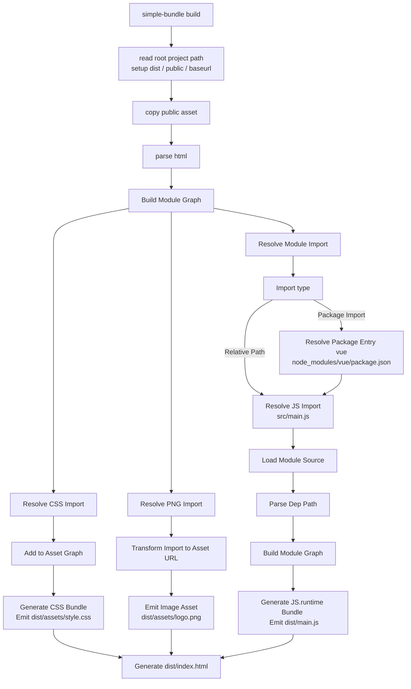

# build

```mermaid
flowchart TB

    Bundle[simple-bundle build]

    Bundle --> Config[read root project path <br/> setup dist / public / baseurl]

    Config --> Asset[copy public asset]

    Asset --> Parse[parse html]

    Parse --> Graph[Build Module Graph]

    Graph --> Css[Resolve CSS Import]
    Css --> Css1[Add to Asset Graph]
    Css1 --> Css2[Generate CSS Bundle<br/>Emit dist/assets/style.css]

    Graph --> Src[Resolve PNG Import]
    Src --> Src1[Transform Import to Asset URL]
    Src1 --> Src2[Emit Image Asset<br/>dist/assets/logo.png]

    Graph --> Mod[Resolve Module Import]
    Mod --> Mod1[Import type]
    Mod1 --> | Relative Path | Mod2[Resolve JS Import <br/> src/main.js]
    Mod1 --> | Package Import | Mod3[Resolve Package Entry <br/>vue<br/>node_modules/vue/package.json]
    Mod3 --> Mod2
    Mod2 --> Mod4[Load Module Source]
    Mod4 --> Mod5[Parse Dep Path]
    Mod5 --> Mod6[Build Module Graph]
    Mod6 --> Mod7[Generate JS.runtime Bundle <br/> Emit dist/main.js]

    Css2 --> Dist[Generate dist/index.html]
    Src2 --> Dist
    Mod7 --> Dist

```

example：[simple-bundle build](https://github.com/angxuejian/simple.bundle)