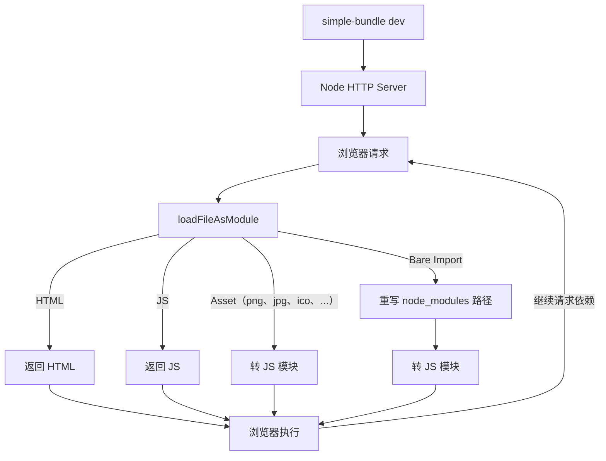

# Dev

```mermaid
flowchart TB
    Dev[simple-bundle dev] --> Server[Node HTTP Server]

    Server --> Request[浏览器请求]
    Request --> Loader[loadFileAsModule]

    Loader -->|HTML| HTML[返回 HTML]
    Loader -->|JS| JS[返回 JS]
    Loader -->|Asset（png、jpg、ico、...）| Asset[转 JS 模块]
    Loader -->|Bare Import| Rewrite[重写 node_modules 路径]

    Rewrite --> Module[转 JS 模块]

    HTML --> Browser[浏览器执行]
    JS --> Browser
    Asset --> Browser
    Module --> Browser

    Browser -->|继续请求依赖| Request
```

example：[simple-bundle dev](https://github.com/angxuejian/simple.bundle)