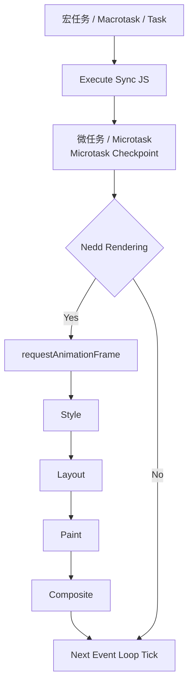

# Event Loop Tick

## Task

| 类型      | API / 来源                        | 说明                                      |
| --------- | --------------------------------- | ----------------------------------------- |
| script    | `<script>`                        | 整个 JS 文件作为第一个宏任务执行          |
| Timer     | `setTimeout`                      | 定时器回调进入 Macrotask Queue            |
| Timer     | `setInterval`                     | 周期定时器，每次回调都是宏任务            |
| UI Event  | `click` / `mousedown` / `mouseup` | 用户交互事件                              |
| UI Event  | `scroll` / `resize`               | 浏览器 UI 事件                            |
| Network   | `XMLHttpRequest`                  | 网络请求回调                              |
| Network   | `fetch`                           | `then` 是微任务，但底层完成回调属于宏任务 |
| Message   | `postMessage`                     | window 之间通信                           |
| Channel   | `MessageChannel`                  | 消息通道任务                              |
| I/O       | 文件 / socket                     | 浏览器底层 IO 回调                        |
| Rendering | `requestIdleCallback`             | 浏览器空闲时执行                          |

## Microtask

| 类型    | API / 来源          | 说明             |
| ------- | ------------------- | ---------------- |
| Promise | `Promise.then()`    | Promise 成功回调 |
| Promise | `Promise.catch()`   | Promise 失败回调 |
| Promise | `Promise.finally()` | Promise 最终回调 |
| Queue   | `queueMicrotask()`  | 直接创建微任务   |
| DOM     | `MutationObserver`  | DOM 变化监听回调 |

## Rendering Pipeline

| 名称                  | 作用                      | 说明                                             |
| --------------------- | ------------------------- | ------------------------------------------------ |
| requestAnimationFrame | 执行动画回调              | 浏览器在下一帧渲染前调用，用于更新 DOM 或 Canvas |
| Style                 | 计算样式                  | 解析 CSS，计算每个元素最终样式（Computed Style） |
| Layout                | 计算布局 / 重排（Reflow） | 计算元素位置和尺寸                               |
| Paint                 | 绘制 / 重绘（Repaint）    | 将元素绘制成像素（文字、颜色、边框等）           |
| Composite             | 图层合成                  | GPU 合成多个图层生成最终画面，是浏览器渲染里最轻量的一层（transform、opacity）                    |
