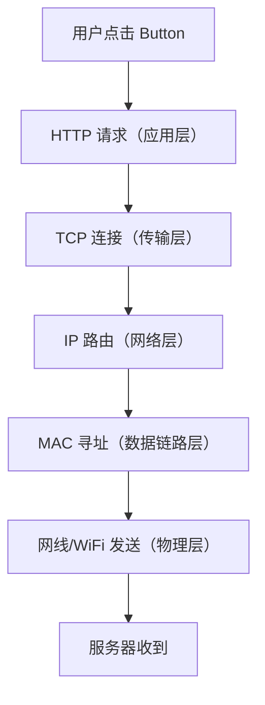

# Network

| 名称             | 示例                   | 作用               | 核心理解                  |
| ---------------- | ---------------------- | ------------------ | ------------------------- |
| IP 地址          | 192.168.1.10           | 设备地址           | 网络中的“门牌号”          |
| 公网 IP          | 120.xx.xx.xx           | 互联网访问地址     | 全球唯一，可公网访问      |
| 内网 IP          | 192.168.x.x            | 局域网地址         | 仅局域网使用，可重复      |
| localhost        | 127.0.0.1              | 当前机器           | 永远指向自己              |
| 子网掩码         | 255.255.255.0          | 区分网络号与主机号 | 判断是否同网段            |
| CIDR             | /24                    | 网络位数量         | 子网掩码简写              |
| /24              | 192.168.1.0/24         | 一个第三段         | 192.168.1.x               |
| /23              | 192.168.0.0/23         | 两个第三段         | 192.168.0.x ~ 192.168.1.x |
| /22              | 192.168.0.0/22         | 四个第三段         | 192.168.0.x ~ 192.168.3.x |
| /16              | 192.168.0.0/16         | 前两段固定         | 192.168.x.x               |
| /8               | 10.0.0.0/8             | 第一段固定         | 10.x.x.x                  |
| 网络地址         | 192.168.1.0            | 表示整个网段       | 不能分配给设备            |
| 广播地址         | 192.168.1.255          | 向整个网段广播     | 不能分配给设备            |
| 网段             | 192.168.1.0/24         | 一组可直接通信设备 | 同网段可直接通信          |
| 网关（Gateway）  | 192.168.1.1            | 当前网络出口       | 通往其它网络              |
| 默认网关         | 192.168.1.1            | 默认转发出口       | 不知道去哪时交给它        |
| DNS              | 8.8.8.8                | 域名解析           | 域名 → IP                 |
| DNS 后缀         | int.xx.com             | 自动补全域名       | 企业内网常见              |
| DHCP             | 自动分配               | 自动配置网络参数   | 自动分 IP/网关/DNS        |
| NAT              | 内网→公网              | 地址转换           | 多设备共享公网 IP         |
| CGNAT            | 100.64.x.x             | 运营商大内网       | 通常没有真公网            |
| MAC 地址         | AA-BB-CC-DD            | 网卡物理地址       | 局域网通信                |
| ARP              | IP → MAC               | 查询 MAC 地址      | 局域网寻址                |
| 端口（Port）     | 8000                   | 区分服务           | 一个 IP 可跑多个服务      |
| HTTP             | :80                    | Web 协议           | 浏览器访问网页            |
| HTTPS            | :443                   | 加密 Web           | 带 TLS 的 HTTP            |
| TCP              | TCP                    | 可靠传输           | 有序、重传                |
| UDP              | UDP                    | 快速传输           | 不保证可靠                |
| 路由器           | 192.168.1.1            | 网络出口设备       | 不同网络之间转发          |
| 交换机           | Switch                 | 扩展 LAN 口        | 同局域网通信              |
| LAN              | 局域网                 | 内部网络           | 同 WiFi/同交换机          |
| WAN              | 广域网                 | 外部网络           | 互联网                    |
| WiFi             | 无线局域网             | 无线通信           | 本质也是 LAN              |
| Ethernet         | 以太网                 | 有线局域网         | 网线通信                  |
| ping             | ping 8.8.8.8           | 测试连通性         | 基于 ICMP                 |
| traceroute       | traceroute google.com  | 查看路由路径       | 数据经过哪些路由器        |
| ipconfig         | ipconfig               | 查看 Windows 网络  | 查看 IP/网关/DNS          |
| ifconfig/ip addr | ip addr                | 查看 Linux 网络    | 查看网卡/IP               |
| 0.0.0.0          | uvicorn --host 0.0.0.0 | 监听所有网卡       | 局域网可访问              |
| 127.0.0.1        | localhost              | 仅本机访问         | 外部无法访问              |
| 10.x.x.x         | 10.0.0.0/8             | 私有 IP            | 企业/云常见               |
| 172.16~31.x.x    | 172.16.0.0/12          | 私有 IP            | Docker 常见               |
| 192.168.x.x      | 192.168.0.0/16         | 私有 IP            | 家用路由器常见            |
| 169.254.x.x      | APIPA                  | DHCP 失败自动分配  | 网络异常常见              |
| 100.64.x.x       | CGNAT                  | 运营商 NAT         | 无公网 IP                 |
| 8.8.8.8          | Google DNS             | 公网 IP            | 全球可路由                |

| 层                      | 典型协议/设备                         | 核心作用            | 你能看到的东西           | 常见设备/工具                             |
| ----------------------- | ------------------------------------- | ------------------- | ------------------------ | ----------------------------------------- |
| 应用层（Application）   | HTTP、HTTPS、WebSocket、SSH、DNS、FTP | 应用之间通信        | URL、接口、JSON、域名    | 浏览器、Nginx、FastAPI、Redis、PostgreSQL |
| 传输层（Transport）     | TCP、UDP                              | 端口通信、可靠传输  | 80、443、8000、TCP连接   | TCP 三次握手、Socket、netstat、ss         |
| 网络层（Network）       | IP、ICMP                              | IP 寻址、跨网络路由 | IP 地址、网关、路由表    | 路由器、ping、traceroute                  |
| 数据链路层（Data Link） | Ethernet、WiFi、MAC、ARP              | 局域网设备通信      | MAC 地址、交换机、ARP 表 | 交换机、网卡、ARP、Bridge                 |
| 物理层（Physical）      | 网线、光纤、无线电、RJ45              | 真正传输比特流      | WiFi 信号、网线连接      | 网卡、Hub、光猫、AP、网线                 |



## WSL2 backend 局域网访问配置指南

| 命令                                                                                                                   | 作用                                        |
| ---------------------------------------------------------------------------------------------------------------------- | ------------------------------------------- |
| `ip addr`                                                                                                              | 查看 WSL2 的虚拟网卡 IP                     |
| `netsh interface portproxy show all`                                                                                   | 查看当前 Windows 端口转发规则               |
| `netsh interface portproxy delete v4tov4 listenaddress=0.0.0.0 listenport=80`                                          | 删除旧的 80 端口转发规则                    |
| `netsh interface portproxy add v4tov4 listenaddress=0.0.0.0 listenport=80 connectaddress=172.30.36.207 connectport=80` | 将 Windows 的 80 端口转发到 WSL2 的 80 端口 |
| `netsh advfirewall firewall add rule name="FastAPI80" dir=in action=allow protocol=TCP localport=80`                   | 开放 Windows 防火墙 80 端口                 |
| `uvicorn app.main:app --host 0.0.0.0 --port 80 --reload`                                                               | 启动 FastAPI 并监听所有网卡                 |
| `http://192.168.3.4`                                                                                                   | 局域网设备访问地址                          |

### 网络结构示意

```
手机 / 平板 / 其他电脑
        ↓
  192.168.3.4:80
        ↓
Windows 防火墙
        ↓
Windows PortProxy
        ↓
172.30.36.207:80
        ↓
WSL2 Ubuntu
        ↓
FastAPI / Nginx
```

### 常见问题

| 问题                               | 原因                             |
| ---------------------------------- | -------------------------------- |
| localhost 可以访问，局域网 IP 不行 | Windows 防火墙未开放             |
| 局域网无法访问 WSL2                | 未配置 `portproxy`               |
| FastAPI 无法被外部访问             | uvicorn 未使用 `--host 0.0.0.0`  |
| 80 端口无法启动                    | Windows 或其他程序占用了 80 端口 |
| Docker 内 nginx 无法访问 FastAPI   | `proxy_pass` 地址错误            |
