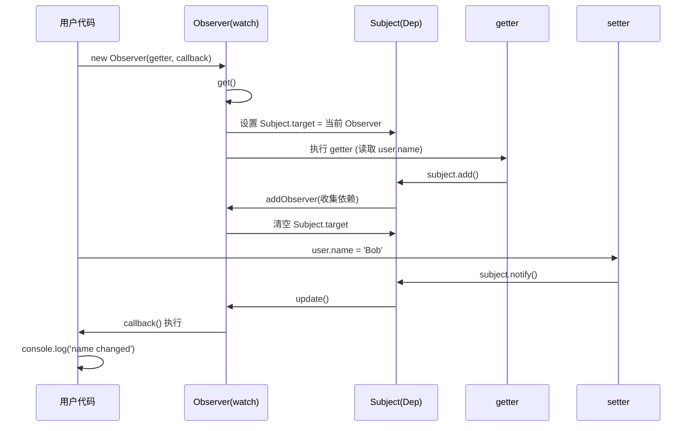

# Observer - watch



## Example

```js

class Subject {
    constructor() {
        this.obsSet = new Set();
    }

    add() {
        // 3、在 add 方法中将当前 Observer 实例添加到 Subject 的 obsSet 中
        if (Subject.target) {
            Subject.target.addObserver(this);
        }

    }

    notify() {
        this.obsSet.forEach(ob => ob?.update());
    }
}

class Observer {
    constructor(getter, callback, isSimplerun = true) {
        this.getter = getter;
        this.callback = callback;

        // simplerun时，不执行get函数; 只为读懂执行逻辑
        if (isSimplerun) {
            this.get();
        }
    }

    get() {
        // 1、设置 Subject.target 为当前 Observer 实例，以便在 getter 中建立依赖关系
        Subject.target = this;
        const value = this.getter();
        Subject.target = null;
        return value;
    }

    addObserver(subject) {
        // 4、在 Observer 的 addObserver 方法中将当前 Observer 实例添加到 Subject 的 obsSet 中
        if (!subject.obsSet.has(this)) {
            subject.obsSet.add(this);
        }
    }

    update() {
        // 6、在 Observer 的 update 方法中执行回调函数，更新视图
        const oldValue = this.value;
        const newValue = this.get();
        this.callback?.(newValue, oldValue);
    }
}

const reaction = (obj, key) => {
    const _key = `_${key}`;
    const subject = new Subject();

    Object.defineProperty(obj, _key, {
        value: obj[key],
        writable: true,
        enumerable: false,
        configurable: true
    })

    Object.defineProperty(obj, key, {
        get() {

            // 2、在 getter 中访问 Subject.target，建立依赖关系
            if (Subject.target) {
                subject.add()
            }

            return this[_key]
        },
        set(newVal) {
            if (newVal === this[_key]) return;

            this[_key] = newVal;
            // 5、在 setter 中调用 Subject 的 notify 方法，通知所有依赖于该属性的 Observer 实例进行更新
            subject.notify();
        }
    });
}

const init = (data) => {
    Object.keys(data).forEach((key) => {
        reaction(data, key)
    })
}

const run = () => {
    const user = {
        name: 'Alice'
    }
    init(user);
  
    const observer = new Observer(() => user.name, () => {
        console.log('name changed to', user.name);
    })

    setTimeout(() => {
        user.name = 'Bob';
    }, 1000);
}
run();


// const simplerun = () => {
//     const subject = new Subject();
//     let name = 'Alice';
//     const observer = new Observer(() => name, () => {
//         console.log('name changed to', name);
//     });
//     Subject.target = observer;
//     subject.add();
//     Subject.target = null;

//     setTimeout(() => {
//         name = 'Bob';
//         subject.notify();
//     }, 1000);
// }
// simplerun()
```